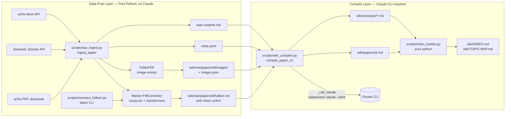

# Self-Contained Data-Prep Analysis

> 2026-04-09 · Task 3 of the 5-task parallel batch
>
> Question this doc answers: **how did we fix the raw-data formula problem, how will we fix the image problem, and which parts of the fixing pipeline depend on Claude vs. pure Python scripts?**
>
> Goal: Gary wants to open-source this project. The *data-prep layer* must be runnable by a fresh clone with just `pip install -r requirements.txt` and no Claude subscription.

---

## 1. Overview

"Self-contained" for this project means a very specific thing:

> A fresh user can clone the repo, `pip install -r requirements.txt`, run `python3 -m scripts.raw_ingest` on any arXiv ID, and get a complete `wiki/raw/papers/{id}/` directory with:
>
> - `meta.yaml`
> - `fulltext.md` — clean markdown with inline LaTeX (`$...$`, `$$...$$`)
> - `images/` + `images.json` — figure assets
> - `repo-readme.md` (if the paper links to a GitHub repo)
>
> …**without ever calling `claude`**.

The **compile layer** (`scripts/wiki_compiler.py`) that turns raw data into a cross-linked research wiki *does* require the Claude CLI. That's intentional — the wiki is the LLM's externalized memory per Karpathy's method — but it is cleanly separated from data prep.

The only two real surfaces a typical open-source user needs to touch are:

| Command | What it does | Claude? |
|---|---|---|
| `python3 -m scripts.raw_ingest` (via `ingest_paper`) | Fetch PDF + metadata + images + LaTeX fulltext | **No** |
| `python3 -m scripts.reextract_fulltext` | Re-run Marker on existing raw papers | **No** |
| `python3 -c "from scripts.wiki_compiler import compile_paper_v2; ..."` | Synthesize wiki page + concept pages | **Yes** |

Everything in the first two rows is pure Python + PyMuPDF + Marker + arXiv Atom API + Semantic Scholar API. No LLM anywhere in the call path.

---

## 2. The Two Layers



### 2a. Data prep layer — pure Python

- **`scripts/raw_ingest.py`** — top-level orchestrator (`ingest_paper`, `reextract_fulltext`, `ingest_batch`).
- **`scripts/reextract_fulltext.py`** — batch CLI that pre-warms the Marker converter once and iterates over every paper under `wiki/raw/papers/*/`.
- **`scripts/fetch_paper.py`** — arXiv Atom API + Semantic Scholar metadata. Legacy HTML fulltext fallback (`fetch_fulltext_html`, `fetch_fulltext_pdf`) kept as a safety net when Marker is unavailable.
- **`scripts/config.py`** — loads paths from `~/.config/paper-collector/config.yaml`. *This is one of the open-sourcing friction points — see §6.*

**Third-party dependencies in the data path:**
- `marker-pdf` (1.10.2) — the Marker PDF→markdown converter.
- `surya-ocr` — pulled in transitively by marker, provides text + equation OCR.
- `transformers` + `torch` — backs the surya models.
- `pymupdf` — image extraction + legacy text fallback.
- `requests`, `feedparser`, `trafilatura`, `pyyaml` — networking + parsing.

**No subprocess call to `claude` anywhere.** Verified by grepping `raw_ingest.py`, `reextract_fulltext.py`, `fetch_paper.py`, `index_builder.py`, `config.py`:

```text
rg 'claude|subprocess' scripts/raw_ingest.py scripts/reextract_fulltext.py \
                      scripts/fetch_paper.py scripts/index_builder.py scripts/config.py
# → no matches
```

### 2b. Compile layer — Claude-dependent

- **`scripts/wiki_compiler.py`** — the only file that actually shells out to `claude`. Every LLM call goes through one helper:

  ```python
  def _call_claude(prompt: str, timeout: int = 300) -> str:
      result = subprocess.run(
          ["claude", "--print", "-p", prompt],
          capture_output=True, text=True, timeout=timeout,
      )
      if result.returncode != 0:
          raise RuntimeError(f"Claude CLI error ...")
      return result.stdout.strip()
  ```

  This is the **single dependency surface** for swapping in a different LLM backend. See §7.

- **`compile_paper_v2(arxiv_id)`** does two Claude calls (1200s timeout each):
  - **Step 1 — Understand + Analyze + Classify.** Reads raw fulltext + existing concept index + topic map, produces a paper page frontmatter + body.
  - **Step 2 — Knowledge Integration.** Updates existing concept pages and creates new concept pages via a single batched prompt.

- **`scripts/index_builder.py`** is pure Python — it just walks the wiki directory and regenerates `INDEX.md`, `papers/INDEX.md`, `concepts/INDEX.md`, `TOPIC-MAP.md` by parsing frontmatter with PyYAML + regex. **No LLM.** A fresh user without Claude can still run `build_all_indexes()` to rebuild their index files.

- **`scripts/taste_engine.py`** also calls `_call_claude` for L3 (LLM-ranked recommendation), but that's the *recommendation pipeline*, not the wiki compile pipeline.

---

## 3. Problem 1 — Formula Extraction (SOLVED)

### 3.1 What was broken

The original Task 2 implementation shipped a heuristic formula extractor in `scripts/raw_ingest.py`:

```python
# scripts/raw_ingest.py  (old approach, still present for legacy reasons)
_MATH_CHAR_RE = re.compile(
    r"[\u0370-\u03ff\u2200-\u22ff\u2a00-\u2aff\u27c0-\u27ef"  # Greek, math ops
    r"\u2190-\u21ff"                                          # arrows
    r"=≈≠≤≥±×÷∞∑∏∫√∂∇∈∉⊂⊆∩∪]"
)

def _line_is_math_heavy(line: str) -> bool:
    stripped = line.strip()
    if len(stripped) < 3 or len(stripped) > 200:
        return False
    if not _MATH_CHAR_RE.search(stripped):
        return False
    alpha = sum(ch.isalpha() and ch.isascii() for ch in stripped)
    math_hits = len(_MATH_CHAR_RE.findall(stripped))
    if alpha > 0 and (math_hits / max(1, alpha)) < 0.08:
        return False
    return True

def extract_formulas(pdf_bytes: bytes) -> str | None:
    # group math-heavy text lines from each page into formulas.md
    ...
```

This produced `formulas.md` — a separate file with line-level candidates grouped by page. **Three problems with it:**

1. **Not actually LaTeX.** The output was Unicode glyphs (`α`, `∑`, `≈`) pulled straight from PyMuPDF's `get_text()` — impossible to render in Obsidian or GitHub markdown.
2. **Decoupled from prose.** Formulas lived in a sidecar file rather than inline with the paragraphs that introduce them. The compile layer couldn't cite an equation in context.
3. **Recall + precision both bad.** True display-math images were invisible to `get_text()`; Greek letters inside ordinary prose falsely matched.

### 3.2 The fix — Marker

The fix landed in Task 2.1 (see `log.md` → `## Task 2.1 Report`). We replaced heuristics with [Marker](https://github.com/VikParuchuri/marker), a transformer-based PDF→markdown converter that produces proper inline LaTeX.

Implementation in `scripts/raw_ingest.py` (lines ~249-317):

```python
# Lazy-loaded singleton — Marker's model dict is expensive (~5-15s).
_MARKER_CONVERTER = None

def _get_marker_converter():
    global _MARKER_CONVERTER
    if _MARKER_CONVERTER is not None:
        return _MARKER_CONVERTER
    try:
        from marker.converters.pdf import PdfConverter
        from marker.models import create_model_dict
    except ImportError:
        logger.warning("marker-pdf not installed; cannot extract inline LaTeX")
        return None
    logger.info("Loading Marker models (one-time)...")
    models = create_model_dict()
    _MARKER_CONVERTER = PdfConverter(artifact_dict=models)
    return _MARKER_CONVERTER

def extract_fulltext_with_latex(pdf_bytes, *, converter=None) -> str | None:
    if not pdf_bytes:
        return None
    conv = converter if converter is not None else _get_marker_converter()
    if conv is None:
        return None

    import tempfile
    from marker.output import text_from_rendered

    tmp_path = None
    try:
        with tempfile.NamedTemporaryFile(suffix=".pdf", delete=False) as tmp:
            tmp.write(pdf_bytes)
            tmp_path = tmp.name
        rendered = conv(tmp_path)
        md_text, _, _ = text_from_rendered(rendered)
        return md_text
    except Exception:
        logger.exception("Marker fulltext extraction failed")
        return None
    finally:
        if tmp_path is not None:
            Path(tmp_path).unlink(missing_ok=True)
```

`ingest_paper()` now prefers Marker and only falls back to the legacy HTML extractor (`scripts/fetch_paper.py::fetch_fulltext`) if Marker is unavailable or raises:

```python
fulltext_written = False
if needs_fulltext and pdf_bytes:
    try:
        latex_md = extract_fulltext_with_latex(pdf_bytes)
    except Exception:
        latex_md = None
    if latex_md:
        fulltext_path.write_text(latex_md, encoding="utf-8")
        fulltext_written = True

if needs_fulltext and not fulltext_written:
    fulltext = fetch_fulltext(arxiv_id)  # legacy HTML → PyMuPDF
    if fulltext:
        fulltext_path.write_text(fulltext, encoding="utf-8")
```

The graceful-degradation path is important for open-sourcing: even if `marker-pdf` fails to install (e.g. on a CPU-only laptop where the user can't wait for surya models to download), `raw_ingest` still produces a usable `fulltext.md` via the legacy HTML extractor.

### 3.3 Why Marker (vs alternatives)

| Tool | Verdict | Why / Why not |
|---|---|---|
| **Marker** | **Chosen** | PyPI-installable (`pip install marker-pdf`), GPU-accelerated, produces inline `$...$`/`$$...$$` out of the box, ~30s/paper on 1× GPU, actively maintained, clean Python API |
| Nougat (Meta) | Rejected | Heavier models, slower, the project has been less active since 2024 |
| MinerU (OpenDataLab) | Rejected | More complex deployment, stronger Chinese focus but overhead not worth it for our use case |
| Pix2Text | Rejected | OCR-centric, not a full PDF→markdown pipeline |
| ❌ Handwritten heuristic | Killed | See §3.1 |

### 3.4 Dependency cost

- `pip install marker-pdf` pulls `surya-ocr`, `transformers`, `torch`, etc. Currently **not in `requirements.txt`** — this is an open-sourcing gap (see §6).
- First run downloads surya models to `~/.cache/datalab/` (hundreds of MB). Subsequent runs reuse them.
- Works on CPU but is 10-20x slower than GPU. For the 29-paper Force-VLA cold-start batch, GPU took ~21 minutes; CPU would take several hours.

### 3.5 Verification

From `log.md` Task 2.1 report:

```
Full re-extraction run (16:33:57 → 16:54:52, 20m 55s):
Summary: 29 total, 29 ok, 0 failed, 0 skipped, 2131 formulas total
```

Sampled `wiki/raw/papers/2602.22088/fulltext.md` (Force Policy) — 41 display-math blocks rendering inline with the prose that defines them. Example:

```markdown
$$\Sigma(p_I) \triangleq \Psi(\mathbf{K}_{\text{env}}(p_I), \boldsymbol{\xi}^*(p_I), \boldsymbol{\mathcal{W}}^*(p_I)). \tag{1}$$

$$\boldsymbol{\xi}^* = \boldsymbol{\xi} - \operatorname{Proj}_{\boldsymbol{W}^*}(\boldsymbol{\xi}) \approx \boldsymbol{\xi} - \operatorname{Proj}_{\boldsymbol{W}}(\boldsymbol{\xi}). \tag{3}$$
```

Greek letters, `\mathbf{}`, `\mathcal{}`, `\operatorname{Proj}`, `\triangleq`, `\tag{N}` all render cleanly in Obsidian and GitHub markdown preview.

### 3.6 Claude dependency in the fix

**Zero.** The entire formula fix happens in pure Python. Marker is a self-contained HuggingFace/PyTorch model; it doesn't phone home to any API. A user with no Claude subscription can run `python3 -m scripts.reextract_fulltext` and get the full 2131-formula corpus built from scratch.

---

## 4. Problem 2 — Image Extraction (Task 1 in-flight, code landed)

> **Status at time of writing:** Task 1 has not yet posted its `## Task 1 Report` to `log.md`, but the code changes in `scripts/raw_ingest.py` have landed (mtime 17:44). This section reflects the actual implementation I read off disk. A verification run may still be in progress.

### 4.1 What was broken

Marker's markdown output is riddled with image placeholders like:

```markdown


```

In `wiki/raw/papers/2602.22088/fulltext.md` there are **27 such references**, but the paper directory only contains `fulltext.md` + `meta.yaml` — **no `images/` directory, no `images.json`**. Marker's `text_from_rendered()` returns a `(markdown, _, images)` tuple, and the original implementation was unpacking it as `md_text, _, _ = text_from_rendered(rendered)`, throwing away the third element.

Meanwhile, Task 2 already shipped a working pure-Python image extractor in `raw_ingest.py`:

```python
def extract_images(pdf_bytes: bytes, out_dir: Path) -> list[dict]:
    # PyMuPDF-based: extracts embedded image XObjects, not rasterized figures
    # - skips tiny images (<32px either side)
    # - caps at _MAX_IMAGES_PER_PAPER = 120
    # - writes page{NNN}-img{MM}.{ext}
```

That PyMuPDF path still works, but it's extracting a *different subset* than Marker sees. PyMuPDF pulls embedded bitmap XObjects; Marker rasterizes full figures (including vector plots) at page-extraction time. The two disagree on which figures exist.

Also, Task 2.1's `reextract_fulltext()` intentionally skipped image extraction (docstring: *"Does not touch arXiv metadata or images/ — only fetches the PDF and overwrites `fulltext.md`"*), so the 29-paper Force-VLA backfill never refreshed images. Result: Marker markdown references that point at nothing.

### 4.2 The fix Task 1 landed

Task 1 added three new functions to `scripts/raw_ingest.py` and a new `reextract_images(arxiv_id)` backfill helper:

1. **`extract_fulltext_and_images_with_marker(pdf_bytes, *, converter=None)`** (lines ~305-346) — unified extractor that actually uses the third element of `text_from_rendered`:

    ```python
    rendered = conv(tmp_path)
    md_text, _, images = text_from_rendered(rendered)
    return md_text, (images or {})
    ```

    Returns `(markdown, {filename: PIL.Image})`. The filenames in the dict match the `` references already in the markdown, so the two are synced by construction.

2. **`save_marker_images(images, out_dir, *, markdown)`** (lines ~366-437) — saves Marker's PIL images to disk under our existing `page{NNN}-img{MM}.{ext}` naming convention and returns `(manifest, rewritten_markdown)`. Key design choices:

    - Parses Marker's `_page_{N}_{Kind}_{idx}.{ext}` filenames with a regex (`_parse_marker_image_name`), converts 0-indexed page to 1-indexed, and re-emits as `page{page:03d}-img{index:02d}.{ext}` — same format as Task 2's PyMuPDF extractor, so any downstream tooling doesn't need to change.
    - Drops images smaller than `_MIN_IMAGE_DIM` (32px) — same tiny-glyph filter as the old extractor.
    - Caps at `_MAX_IMAGES_PER_PAPER` (120) and drops overflow refs entirely (returns `""` in the rename map, which `_rewrite_marker_refs` interprets as "delete the ref").
    - Handles mode conversion for JPEG saving (`pil.convert("RGB")` when source has alpha/palette).
    - Returns a manifest with `{page, index, path, width, height, ext, bytes}` — byte-identical shape to Task 2's output.

3. **`_rewrite_marker_refs(markdown, rename_map)`** (lines ~440-457) — regex-based rewrite of `` → ``. Orphaned references (tiny images that got dropped) are stripped from the markdown entirely. Regex is `!\[([^\]]*)\]\(([^)\s]+)\)` — doesn't try to handle whitespace or parens inside paths, which is fine for Marker's deterministic naming.

4. **`reextract_images(arxiv_id, wiki_dir, *, converter=None)`** (lines ~701-774) — the batch backfill entrypoint. For each paper it:
    - Reads `meta.yaml` to verify the paper exists.
    - Downloads the PDF.
    - Runs `extract_fulltext_and_images_with_marker`.
    - **Wipes any stale images** from `images/` before writing (important — prevents old PyMuPDF extractions from coexisting with fresh Marker output).
    - Calls `save_marker_images` to write files + rewrite markdown.
    - Overwrites `fulltext.md` with the rewritten markdown.
    - Writes `images.json`.
    - Touches `meta.yaml` `assets` + `updated_at`.
    - Returns `{status, images, chars, refs}` for batch summaries.

### 4.3 What about `ingest_paper`?

A subtle note: as of the 17:44 raw_ingest.py snapshot, **`ingest_paper()` has NOT yet been updated to use the new unified extractor**. It still calls `extract_fulltext_with_latex` (single-return-value version) and separately calls `extract_images` (PyMuPDF path). So fresh ingests of new papers still use the split path, and only the explicit `reextract_images` backfill uses the unified one.

This might be intentional (keep the ingest path stable while backfilling), or it might be a follow-up Task 1 still has in flight. Worth flagging to Gary: for true self-containedness, `ingest_paper` should eventually call `extract_fulltext_and_images_with_marker` once as well, so a single Marker invocation produces *both* fulltext and images, rather than running Marker for text and PyMuPDF for images.

### 4.4 Claude dependency in the image fix

**Zero.** Every new function lives in `scripts/raw_ingest.py`, imports only `marker`, `PIL`, `pymupdf`, `re`, and stdlib. No subprocess calls, no API calls, no LLM. A user running `python3 -c "from scripts.raw_ingest import reextract_images; reextract_images('2411.15753')"` gets complete image-bearing fulltext without ever touching Claude.

### 4.5 The batch CLI

Task 1 also added `scripts/extract_images_cli.py` — a batch CLI that mirrors `reextract_fulltext.py`:

```bash
python3 -m scripts.extract_images_cli                 # all papers
python3 -m scripts.extract_images_cli 2411.15753      # one paper
python3 -m scripts.extract_images_cli --limit 5       # first 5
python3 -m scripts.extract_images_cli --dry-run       # list only
```

Pre-warms the Marker converter once and reuses it across the whole batch, same pattern as `reextract_fulltext.py`. Calls `reextract_images(arxiv_id, converter=converter)` per paper.

### 4.6 Still-open questions

- Has Task 1 actually executed `extract_images_cli` across all 29 papers? Until `log.md` gets a `## Task 1 Report`, we only have the code, not the verification run. On-disk spot-check: `ls wiki/raw/papers/2602.22088/` still shows only `fulltext.md` + `meta.yaml` — so the batch has either not finished or is still running at the time of writing.
- Does `ingest_paper` eventually migrate to the unified extractor? See §4.3. Today it still runs Marker once for text and PyMuPDF separately for images, which is wasteful and produces a different image set than the Marker backfill path.

---

## 5. Dependency Map

Every script in `scripts/` tagged `[pure-python]` or `[claude-dependent]`:

| Script | Tag | Notes |
|---|---|---|
| `scripts/raw_ingest.py` | **[pure-python]** | Marker + PyMuPDF. No `_call_claude`. |
| `scripts/reextract_fulltext.py` | **[pure-python]** | Batch CLI over Marker (text only). |
| `scripts/extract_images_cli.py` | **[pure-python]** | Batch CLI over Marker (text + images, Task 1). |
| `scripts/fetch_paper.py` | **[pure-python]** | arXiv Atom + S2 API + trafilatura. |
| `scripts/index_builder.py` | **[pure-python]** | Walks `wiki/` and builds INDEX/TOPIC-MAP files. |
| `scripts/config.py` | **[pure-python]** | Reads `~/.config/paper-collector/config.yaml`. |
| `scripts/embedding_store.py` | **[pure-python]** | `sentence-transformers` local model. |
| `scripts/bootstrap_embeddings.py` | **[pure-python]** | Cold-start corpus builder. ⚠ Hardcoded `/home/gary/` path. |
| `scripts/profile_bootstrap.py` | **[pure-python]** | ⚠ Hardcoded `/home/gary/` path. |
| `scripts/rss_fetcher.py` | **[pure-python]** | Atom/RSS parsing. |
| `scripts/search_papers.py` | **[pure-python]** | arXiv + S2 search. |
| `scripts/source_discovery.py` | **[pure-python]** | Heuristic source discovery. |
| `scripts/search_force_vla.py` | **[pure-python]** | Cold-start topic search. |
| `scripts/generate_wordcloud.py` | **[pure-python]** | matplotlib + wordcloud. |
| `scripts/zotero_client.py` | **[pure-python]** | Zotero API writes. |
| `scripts/notion_client.py` | **[pure-python]** | Notion API writes. |
| `scripts/git_writer.py` | **[pure-python]** | Uses `subprocess.run(["git", ...])`. **Not** claude. |
| `scripts/feedback.py` | **[claude-dependent]** | Triggers `compile_paper_v2` on High papers. |
| `scripts/ingest.py` | **[claude-dependent]** | Manual ingest CLI, calls `compile_paper_v2`. |
| `scripts/daily_pipeline.py` | **[claude-dependent]** | Orchestrator that runs feedback → compile. |
| `scripts/cold_start_force_vla.py` | **[claude-dependent]** | Uses `compile_batch_v2`. |
| `scripts/taste_engine.py` | **[claude-dependent]** | L3 ranking calls `claude --print`. |
| `scripts/wiki_compiler.py` | **[claude-dependent]** | The entire file. `_call_claude` is the dependency surface. |
| `scripts/daily_search.sh` | **[pure-python]** | Shell wrapper for daily_search. ⚠ Hardcoded `/home/gary/` path. |

**Summary:** 16 of 24 scripts are pure-python. All **data-prep** is pure-python. All **LLM work** is isolated in `wiki_compiler.py` + its callers (`compile_paper_v2`, `compile_batch_v2`, `ingest.py`, `feedback.py`, `cold_start_force_vla.py`, `daily_pipeline.py`, `taste_engine.py`).

A user who wants *only* the knowledge-base data (no Claude) has a clean slice:
```bash
# Fetch metadata + PDF + Marker fulltext + Marker-aligned images
python3 -c "from scripts.raw_ingest import ingest_paper; ingest_paper('2411.15753')"

# Re-run Marker on existing papers (text only)
python3 -m scripts.reextract_fulltext

# Re-run Marker end-to-end (text + images, rewrite markdown refs)
python3 -m scripts.extract_images_cli

# Rebuild wiki INDEX files
python3 -c "from scripts.index_builder import build_all_indexes; build_all_indexes()"
```
That's the whole pure-python surface.

---

## 6. Open-Sourcing Checklist

Concrete items needed before release:

### 6.1 README.md updates
- [ ] Add a **"Two Layers"** section explaining data-prep vs compile-layer split (can crib directly from §2 of this doc).
- [ ] Add a **"Running without Claude"** section showing the pure-python command set from §5.
- [ ] Add a **"Model downloads"** warning explaining first-run will fetch ~hundreds of MB of surya/transformers models to `~/.cache/datalab/` and `~/.cache/huggingface/`.
- [ ] Document that `paper-rec` conda env is **not required** — any Python 3.10+ venv works.

### 6.2 requirements.txt — CRITICAL MISSING DEPS
Current `requirements.txt`:
```
requests>=2.31
feedparser>=6.0
pyzotero>=1.5
notion-client>=2.0
wordcloud>=1.9
matplotlib>=3.8
pyyaml>=6.0
pytest>=8.0
trafilatura>=2.0
sentence-transformers>=3.0
peft>=0.10
numpy>=1.24
pymupdf>=1.24
```

**Missing:**
- [ ] `marker-pdf>=1.10` — this is **critical**; the formula extraction in Task 2.1 will silently fall back to the legacy HTML path without it.
- [ ] `surya-ocr` — transitive dep of marker-pdf, but worth pinning.
- [ ] `torch` — transitive via sentence-transformers + marker, but pin for reproducibility.
- [ ] `transformers` — same.

**Recommended separation (optional but clean):**
Split into two files so users without GPU/Claude can still do basic ops:

```
# requirements-base.txt     — minimal data-prep
requests>=2.31
feedparser>=6.0
pyyaml>=6.0
trafilatura>=2.0
pymupdf>=1.24

# requirements-full.txt     — full pipeline with Marker + embeddings
-r requirements-base.txt
marker-pdf>=1.10
sentence-transformers>=3.0
peft>=0.10
numpy>=1.24
wordcloud>=1.9
matplotlib>=3.8

# requirements-integrations.txt — external writes (Zotero/Notion)
-r requirements-full.txt
pyzotero>=1.5
notion-client>=2.0
```

### 6.3 Secrets / config
- [ ] Add a `.env.example` or `config.example.yaml` showing the expected shape of `~/.config/paper-collector/config.yaml`.
- [ ] Document that arXiv API needs no key, Semantic Scholar is optional, Zotero/Notion keys are needed only for those integrations.
- [ ] `scripts/config.py::get_wiki_path()` currently **hard-requires** `~/.config/paper-collector/config.yaml` to exist. A fresh clone will KeyError/FileNotFoundError here before it can do anything. Either:
  - fall back to `Path(__file__).parent.parent / "wiki"` when the config file is missing, or
  - ship a starter `config.yaml` in the repo and have `get_wiki_path` load from there by default.

### 6.4 Hardcoded paths to sanitize

From `rg '/home/gary|/Users/' scripts/`:
```
scripts/daily_search.sh:5:         cd /home/gary/Documents/awesome-robot-learning
scripts/daily_search.sh:13:        LOG_FILE="/home/gary/Documents/awesome-robot-learning/logs/daily_search_$(date +%Y%m%d).log"
scripts/profile_bootstrap.py:173:  humanoid_readme = Path("/home/gary/Documents/awesome-humanoid-robot-learning/README.md")
scripts/bootstrap_embeddings.py:183:                              "/home/gary/Documents/awesome-humanoid-robot-learning/README.md"
```
- [ ] `daily_search.sh` — replace with `$(dirname "$0")/..` anchor.
- [ ] `profile_bootstrap.py` + `bootstrap_embeddings.py` — these reference a *sibling* awesome-list used as the taste-bootstrap positive-sample set. Make the sibling path configurable via a constant or CLI flag; don't ship someone else's repo path as a default.

### 6.5 Test setup
- [ ] Document the pytest invocation: `python3 -m pytest tests/ -v --override-ini="addopts=" -p no:cacheprovider` — this bypasses the ROS pytest plugin that pollutes `conftest.py` on typical ROS-enabled Ubuntu workstations. Without this note, fresh clones on ROS machines will see bizarre errors.
- [ ] Mark Marker-dependent tests clearly; most are already mocked (see `tests/test_raw_ingest.py` `TestExtractFulltextWithLatex` and `TestReextractFulltext` — they patch `_get_marker_converter` so CI doesn't need GPU).

### 6.6 Wiki seed
- [ ] Decide whether to ship `wiki/raw/papers/*` in the public repo. Pro: users can see the output format without running anything. Con: repo size balloons (images add up fast).
- [ ] At minimum, ship *one* worked example (e.g. `2411.15753`) as a reference fixture.

---

## 7. What Cannot Be Removed From Claude

Honest accounting of what *does* need an LLM:

### 7.1 `compile_paper_v2` — paper → wiki synthesis
This is **intentionally LLM-backed**. The whole point of the Karpathy method is that the wiki IS the LLM's externalized memory. Replacing the compile step with a script would mean:
- No concept extraction — the LLM decides which phrases in a paper become concept pages, and which are duplicates of existing ones.
- No cross-paper linking — the LLM reads existing concept pages before writing a new paper page, so the synthesis *references prior knowledge*.
- No `TOPIC-MAP.md` maintenance — that file is the LLM's own mental model of the research landscape.

This isn't accidental LLM-dependence; it's the whole design.

### 7.2 `taste_engine.py` L3 ranking
The three-level recommendation funnel ends with an LLM that ranks the top candidates against the user's taste profile. This can be replaced with an embedding-only ranker (L1/L2 would still work) but quality drops.

### 7.3 The escape hatch: `_call_claude` is the single swap point

Every LLM call in the wiki compile layer goes through `_call_claude` in `scripts/wiki_compiler.py:28-44`. If you want to swap in a different LLM, this is the only function you need to change:

```python
def _call_claude(prompt: str, timeout: int = 300) -> str:
    # Current: subprocess.run(["claude", "--print", "-p", prompt], ...)
    # Swap for: openai.chat.completions.create(...)
    # Swap for: anthropic.messages.create(...)
    # Swap for: ollama.generate(...)  # local Llama
    ...
```

**Currently there is NO abstraction layer** — the function is named `_call_claude` and it literally `subprocess.run`s the `claude` CLI. Suggested refactor before open-sourcing:

1. Rename `_call_claude` → `_call_llm`.
2. Dispatch on an environment variable `LLM_BACKEND=claude|openai|anthropic|ollama`.
3. Keep `claude` as the default because that's what Gary uses, but make it swappable without editing code.

That's a ~30 line change. It would significantly lower the barrier for open-source contributors who don't have a Claude subscription but want to try the wiki compile pipeline with a local model.

`taste_engine.py` has its own duplicate `subprocess.run(["claude", ...])` block (~line 309) that should be refactored to reuse the same `_call_llm` shim once it exists.

### 7.4 What a "no-Claude" user actually gets

Without Claude, a user can:
- ✅ Fetch and parse arXiv metadata
- ✅ Download PDFs and extract clean LaTeX fulltext with Marker
- ✅ Extract images with PyMuPDF
- ✅ Rebuild wiki index files (`INDEX.md`, `papers/INDEX.md`, `concepts/INDEX.md`, `TOPIC-MAP.md`) — index_builder is pure Python
- ✅ Embedding-based L1/L2 recommendation
- ✅ Write to Zotero/Notion

Without Claude, a user CANNOT:
- ❌ Auto-generate `wiki/papers/*.md` analysis pages
- ❌ Auto-generate `wiki/concepts/*.md` pages
- ❌ L3 LLM taste ranking

That's a clean, documentable split. The raw data layer (which is the expensive+slow part) works for everyone; the LLM-synthesized wiki layer is opt-in.

---

## 8. Risks for a Fresh Clone

Things that might break on first `git clone && pip install -r requirements.txt && python3 -m scripts.raw_ingest 2411.15753`:

### 8.1 Marker model download
First invocation of `_get_marker_converter()` triggers a multi-hundred-MB download of surya-ocr and transformer checkpoints into `~/.cache/datalab/` and `~/.cache/huggingface/`. This will look like a hang for 2-10 minutes. **Document this explicitly in the README.**

### 8.2 CUDA vs CPU
Marker auto-detects GPU. On a CPU-only machine it still works but per-paper extraction goes from ~30s to ~5-10 minutes. For a 29-paper batch that's the difference between "lunch break" and "overnight run". **Add a `--cpu-slow-warn` note or a dry-run estimator.**

### 8.3 ROS pytest plugin pollution
Tests fail with cryptic errors on ROS-enabled Ubuntu unless invoked with:
```bash
python3 -m pytest tests/ -v --override-ini="addopts=" -p no:cacheprovider
```
CLAUDE.md documents this, but the open-source README should repeat the warning because users without the internal context won't know why `pytest tests/` is failing.

### 8.4 `~/.config/paper-collector/config.yaml` required
As noted in §6.3, `scripts/config.py::get_wiki_path()` will FileNotFoundError on a fresh clone because it unconditionally loads this file. **This is the single biggest first-run blocker.** A new user running `ingest_paper("2411.15753")` from Python will crash before Marker ever loads.

Minimum fix: wrap `get_wiki_path` in a `try/except` that falls back to the repo-local `wiki/` directory when the config file is missing.

### 8.5 `marker-pdf` not in requirements.txt
Biggest silent failure mode: user `pip install`s, runs `raw_ingest`, and gets the legacy HTML extractor because marker wasn't installed. They'll think "it works" and submit papers with noisy Unicode fulltext, not realizing the formula-extraction pipeline never ran. **Fix: add to requirements.txt before release.**

### 8.6 Network / arXiv rate limits
Batch ingestion at high concurrency will hit arXiv's rate limiter. `ingest_batch` has a `delay=1.0` between papers but no exponential backoff on 429s. Low-priority for open-sourcing (users will typically ingest 1-5 papers at a time) but worth documenting.

---

## 9. Tl;dr for the open-source pitch

> *Awesome-Robot-Learning* is a research wiki builder that uses LLMs to compile a cross-linked knowledge base from arXiv papers, inspired by Karpathy's personal LLM knowledge base method. The expensive, slow, deterministic parts — PDF download, LaTeX extraction via Marker, image extraction via PyMuPDF, embedding-based recommendation — are pure Python and work without any LLM subscription. The cheap, fast, non-deterministic parts — paper synthesis, concept extraction, topic-map maintenance — use Claude by default but can be swapped for any LLM by editing a single 15-line function.
>
> Clone, `pip install -r requirements.txt`, run `python3 -m scripts.raw_ingest 2411.15753`, and you get a complete raw paper directory with inline-LaTeX fulltext and extracted figures. Add a Claude subscription (or point the LLM shim at your preferred backend) if you want the auto-generated wiki on top.

---

## 10. Appendix — Key File References

| Purpose | File | Key symbols |
|---|---|---|
| Marker integration (text) | `scripts/raw_ingest.py` | `_get_marker_converter`, `extract_fulltext_with_latex`, `reextract_fulltext` |
| Marker integration (text + images) | `scripts/raw_ingest.py` | `extract_fulltext_and_images_with_marker`, `save_marker_images`, `_rewrite_marker_refs`, `reextract_images` |
| Image extraction (PyMuPDF legacy) | `scripts/raw_ingest.py` | `extract_images`, `_fetch_pdf_bytes` |
| Batch CLI — text only | `scripts/reextract_fulltext.py` | `run`, `main` |
| Batch CLI — text + images | `scripts/extract_images_cli.py` | `run`, `main` |
| Legacy HTML fallback | `scripts/fetch_paper.py` | `fetch_fulltext`, `fetch_fulltext_html`, `fetch_fulltext_pdf` |
| Claude CLI shim | `scripts/wiki_compiler.py:28-44` | `_call_claude` |
| Two-step compile | `scripts/wiki_compiler.py:872-1009` | `compile_paper_v2` |
| Pure-python index build | `scripts/index_builder.py` | `build_all_indexes`, `parse_frontmatter` |
| Config loader (blocker) | `scripts/config.py:92-95` | `get_wiki_path` |
| Requirements gap | `requirements.txt` | missing `marker-pdf` |
