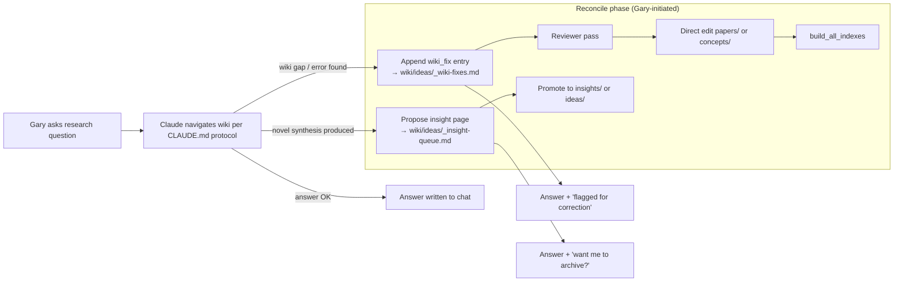
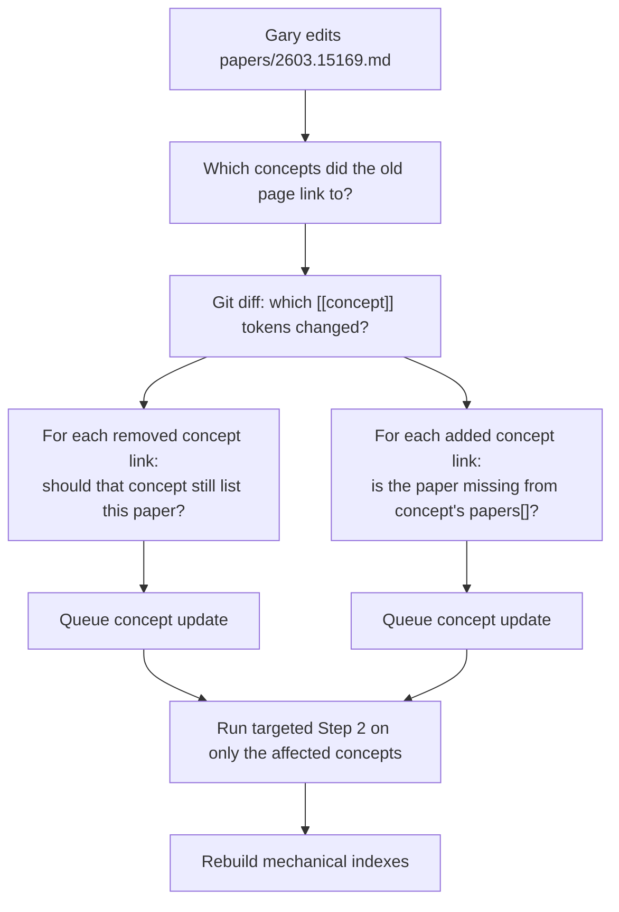
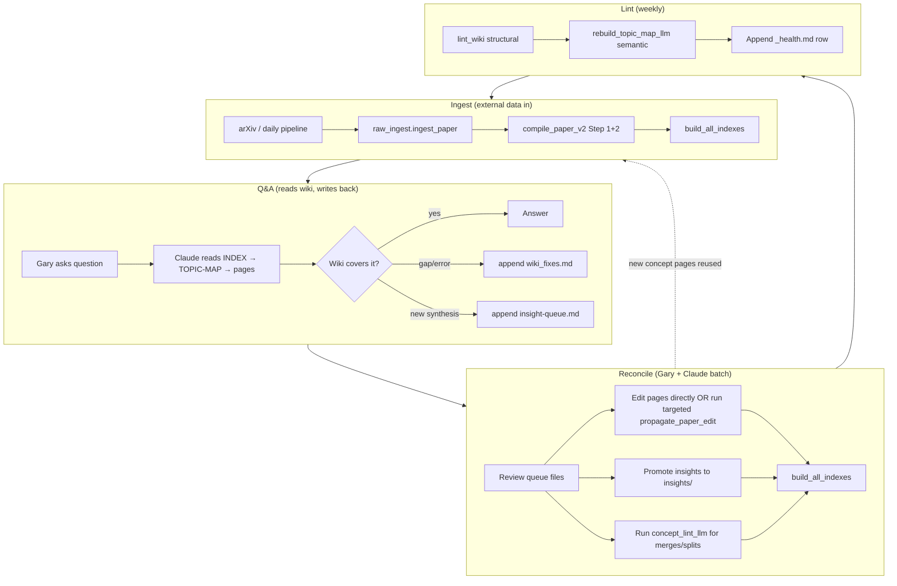

# Wiki Design: Indexes, Ingestion & Evolution Loop

> Status: design doc for Task 2 (compile-phase) kick-off.
> Date: 2026-04-09
> Scope: how the research wiki's indexes cross-reference each other, how a
> new paper flows through ingest → compile → index, and — the important part —
> how ongoing Q&A with Claude refines the wiki over time so it actually gets
> smarter instead of just bigger.
>
> Companion to: [`llm-knowledge-base-design.md`](../llm-knowledge-base-design.md)
> (Karpathy-method architecture discussion) and [`CLAUDE.md`](../CLAUDE.md)
> (navigation protocol).

Mental model, one paragraph: the wiki is the LLM's externalised memory.
Because the model is stateless, every "smart" thing we want it to do next
month has to be written down in wiki files today. So the wiki isn't just
output — it's the substrate the next Claude invocation will read. That
reframes index design: indexes are not a navigation convenience for humans,
they are the attention scaffolding for stateless agents.

---

## Part 1 — Index Architecture (Static View)

### 1.1 Index Hierarchy

```mermaid
graph TD
    subgraph L0["L0 · Global entry"]
        INDEX["wiki/INDEX.md<br/>stats · recent · health"]
    end

    subgraph L1["L1 · Semantic & catalogue"]
        TOPIC["wiki/TOPIC-MAP.md<br/>LLM-maintained hierarchy"]
        PIDX["wiki/papers/INDEX.md<br/>papers by year"]
        CIDX["wiki/concepts/INDEX.md<br/>concepts A-Z"]
    end

    subgraph L2["L2 · Canonical pages"]
        PPAGE["wiki/papers/{arxiv_id}.md<br/>per-paper analysis (中文)"]
        CPAGE["wiki/concepts/{slug}.md<br/>per-concept synthesis (中文)"]
    end

    subgraph L3["L3 · Source of truth (raw)"]
        META["wiki/raw/papers/{id}/meta.yaml"]
        FULL["wiki/raw/papers/{id}/fulltext.md"]
        IMG["wiki/raw/papers/{id}/images/ + images.json"]
        FORM["wiki/raw/papers/{id}/formulas.md"]
        REPO["wiki/raw/papers/{id}/repo-readme.md"]
    end

    INDEX --> TOPIC
    INDEX --> PIDX
    INDEX --> CIDX
    TOPIC --> CPAGE
    PIDX --> PPAGE
    CIDX --> CPAGE
    PPAGE -.->|"[[concept]]"| CPAGE
    CPAGE -.->|"[[arxiv_id]]"| PPAGE
    PPAGE -.->|raw: raw/papers/{id}| META
    META --> FULL
    META --> IMG
    META --> FORM
    META --> REPO
```

- **L0** is the home page Claude sees first. `build_global_index()` in
  [`scripts/index_builder.py:175`](../scripts/index_builder.py) is mechanical
  and rebuilt every compile.
- **L1/TOPIC-MAP** is special: `build_topic_map_scaffold()`
  ([index_builder.py:292](../scripts/index_builder.py)) writes the file
  **only if it doesn't already exist**. Once it's there, the LLM owns it.
- **L1/papers-INDEX and concepts-INDEX** are destructively rebuilt from L2
  frontmatter every call to `build_all_indexes()`. This is fine — they're
  deterministic projections of L2.
- **L2** is where Claude's synthesis lives (paper analyses and concept
  articles). This is the truth for "what the LLM thinks about this paper"
  and "what the field calls this concept".
- **L3** is the truth for bibliographic metadata and source text. The
  compiler reads L3, never writes to it. Only `raw_ingest.ingest_paper()`
  writes L3 — plus one narrow exception where the compiler stamps
  `compile_status` back into `meta.yaml` at
  [wiki_compiler.py:992-1002](../scripts/wiki_compiler.py).

### 1.2 Cross-Reference Matrix

What links to what, and in which direction:

| From → To | Mechanism | Who writes it |
|-----------|-----------|---------------|
| `INDEX.md` → `papers/INDEX.md`, `concepts/INDEX.md`, `TOPIC-MAP.md` | Navigation table | `build_global_index` (mechanical) |
| `INDEX.md` → `papers/{id}.md` | "Recent" table (last 7 days) | `build_global_index` — reads `compiled:` frontmatter |
| `papers/INDEX.md` → `papers/{id}.md` | `[[arxiv_id]]` wikilink | `build_paper_index` (mechanical) |
| `papers/INDEX.md` → `concepts/{slug}.md` | `[[Concept Name]]` tags in row | `build_paper_index`, reads paper frontmatter `concepts:` list |
| `concepts/INDEX.md` → `concepts/{slug}.md` | `[[Concept Name]]` wikilink | `build_concept_index` (mechanical) |
| `TOPIC-MAP.md` → `concepts/{slug}.md` | `[[Concept Name]]` under topic heading | Initially `build_topic_map_scaffold`, then LLM-maintained |
| `papers/{id}.md` → `concepts/{slug}.md` | Inline `[[Concept Name]]` + YAML `concepts:` list | Step 1 of `compile_paper_v2` (LLM) |
| `papers/{id}.md` → `raw/papers/{id}/` | `raw:` field in frontmatter | Step 1 of `compile_paper_v2` (LLM, with path templated in prompt) |
| `concepts/{slug}.md` → `papers/{id}.md` | `[[arxiv_id]]` / `[[paper title]]` inline + YAML `papers:` list | Step 2 of `compile_paper_v2` (LLM) |
| `concepts/{slug}.md` → other `concepts/{slug}.md` | `[[Other Concept]]` inline | LLM, organically written during Step 2 |
| `raw/.../meta.yaml` → `papers/{id}.md` | `compile_status.wiki_page` field | Compiler stamps after success, [wiki_compiler.py:994](../scripts/wiki_compiler.py) |
| (back-link graph) | Obsidian reads `[[]]` and computes inverse | Obsidian, at view time |

Two important properties fall out of this:

1. **Concept pages are the hub.** Both papers and the topic map point into
   them. If you break a concept page name/slug, you break the whole link
   graph. Slugging is centralised in `_slugify()`
   ([wiki_compiler.py:47-63](../scripts/wiki_compiler.py)) — any change to
   that function is a migration event, not a refactor.
2. **There is no explicit reverse index.** Obsidian-style `[[backlinks]]`
   are computed at view time by reading all files. `lint_wiki()`
   ([wiki_compiler.py:1084](../scripts/wiki_compiler.py)) is the only thing
   that scans the whole wiki looking for broken/dangling references.

### 1.3 Source-of-Truth Ownership

Separating "who can write this field" prevents the compiler and
`index_builder` from fighting each other.

| Field / file | Source of truth | Writer | Notes |
|--------------|-----------------|--------|-------|
| arXiv id, authors, date, venue, url | `raw/.../meta.yaml` | `raw_ingest.ingest_paper()` | Never edit downstream |
| fulltext text + images + formulas | `raw/.../fulltext.md`, `images/`, `formulas.md` | `raw_ingest` (Marker for fulltext) | Regenerate via `reextract_fulltext()` |
| paper's `compile_status` | `raw/.../meta.yaml` | `compile_paper_v2` writes back | Only compiler writes this sub-field |
| paper's `summary`, `concepts[]`, `new_concepts[]` | `papers/{id}.md` frontmatter | Step 1 LLM | Consumed by `build_paper_index` |
| paper body (deep analysis) | `papers/{id}.md` body | Step 1 LLM | Claude owns it end-to-end |
| concept canonical definition | `concepts/{slug}.md` body | Step 2 LLM | Merged organically across papers |
| concept's `papers[]` list | `concepts/{slug}.md` frontmatter | Step 2 LLM | Must include every paper that cites it |
| concept's `parent_topic` | `concepts/{slug}.md` frontmatter | Step 2 LLM (initial) + lint | Feeds `build_topic_map_scaffold` |
| topic hierarchy | `TOPIC-MAP.md` | LLM lint (proposed) | `build_topic_map_scaffold` only writes once |
| global stats, recent list, health counts | `INDEX.md` | `build_global_index` (mechanical) | Overwritten every rebuild |
| year-grouped paper catalogue | `papers/INDEX.md` | `build_paper_index` (mechanical) | Overwritten every rebuild |
| A-Z concept catalogue | `concepts/INDEX.md` | `build_concept_index` (mechanical) | Overwritten every rebuild |

### 1.4 Mechanical vs. Synthesised Content

It is important to keep these straight — they have different failure modes
and different "is this stale?" semantics.

| File | Mechanical parts | LLM-synthesised parts |
|------|------------------|------------------------|
| `INDEX.md` | 100% mechanical. `build_global_index()` | — |
| `papers/INDEX.md` | 100% mechanical. `build_paper_index()` projects L2 frontmatter | — (the per-row `summary` was written by LLM in the L2 file, but the index itself just copies it) |
| `concepts/INDEX.md` | 100% mechanical. `build_concept_index()` | — |
| `TOPIC-MAP.md` | Only the initial scaffold | Every edit after scaffold creation is the LLM. Mechanical rebuild is explicitly refused at [index_builder.py:301-303](../scripts/index_builder.py) |
| `papers/{id}.md` | YAML fence assembly, path templating | Frontmatter structure + body are 100% LLM |
| `concepts/{slug}.md` | — | 100% LLM |
| `raw/.../meta.yaml` | Bibliographic fields (from arXiv/S2 APIs) | — |
| `raw/.../fulltext.md` | PDF → markdown via Marker | — |

**Rule of thumb:** anything "mechanical" is idempotent and safe to rerun at
any time. Anything "synthesised" costs Claude tokens and must not be
clobbered by an index rebuild. This is why `build_topic_map_scaffold`
short-circuits if the file exists — miss that guard and you nuke Gary's
hand-curated (or LLM-curated) topic tree on every run.

---

## Part 2 — Ingestion Flow (New Paper Arrives)

### 2.1 Step-by-Step Trace

The current manual entry point is `python3 -m scripts.ingest 2411.15753`
([scripts/ingest.py:85](../scripts/ingest.py)).

```mermaid
sequenceDiagram
    autonumber
    participant User as Gary / daily_pipeline
    participant CLI as scripts/ingest.py
    participant Raw as raw_ingest.ingest_paper
    participant Claude as compile_paper_v2
    participant Idx as build_all_indexes

    User->>CLI: arxiv_id
    CLI->>Raw: ingest_paper(id, force=?)
    Raw->>Raw: fetch_arxiv_metadata (id → title, authors, date, …)
    Raw->>Raw: fetch_s2_metadata (optional, for has_code)
    Raw->>Raw: _fetch_pdf_bytes → Marker → fulltext.md
    Raw->>Raw: extract_images → images/ + images.json
    Raw->>Raw: extract_formulas (legacy; Marker inlines LaTeX now)
    Raw->>Raw: _fetch_repo_readme (if project_url)
    Raw->>Raw: _write_meta_yaml (compile_status.stale=true)
    Raw-->>CLI: paper_dir path
    CLI->>Claude: compile_paper_v2(id)
    Claude->>Claude: load_raw_content (meta + fulltext + repo)
    Claude->>Claude: read concepts/INDEX.md + TOPIC-MAP.md
    Claude->>Claude: Step 1 LLM call (Understand + Analyse + Classify)
    Claude->>Claude: _parse_step1_output → frontmatter + body
    Claude->>Claude: write papers/{id}.md
    Claude->>Claude: collect existing concept pages for concepts[]
    Claude->>Claude: Step 2 LLM call (Knowledge Integration)
    Claude->>Claude: _parse_step2_output → per-concept updates
    Claude->>Claude: write concepts/{slug}.md (create or update)
    Claude->>Claude: stamp raw meta.yaml compile_status
    Claude-->>CLI: {paper_page, concepts_updated, concepts_created}
    CLI->>Idx: build_all_indexes (only if compiled > 0)
    Idx->>Idx: build_paper_index (L2 → papers/INDEX.md)
    Idx->>Idx: build_concept_index (L2 → concepts/INDEX.md)
    Idx->>Idx: build_topic_map_scaffold (no-op if exists)
    Idx->>Idx: build_global_index (reads all → INDEX.md)
    Idx-->>CLI: paths
```

### 2.2 What Gets Touched At Each Step

| Step | Creates / touches | Overwrites? |
|------|-------------------|-------------|
| `ingest_paper` | `raw/papers/{id}/meta.yaml`, `fulltext.md`, `images/*`, `images.json`, `formulas.md`, `repo-readme.md` | Idempotent — skips if `meta.yaml` exists unless `force=True` |
| `compile_paper_v2` Step 1 | `papers/{id}.md` | Overwritten every compile — old analysis is discarded |
| `compile_paper_v2` Step 2 | `concepts/{slug}.md` for every concept in the paper's frontmatter | Updates existing concept pages in place; creates new ones |
| `compile_paper_v2` finalise | `raw/papers/{id}/meta.yaml` `compile_status` subfield | Only this subfield |
| `build_paper_index` | `papers/INDEX.md` | Always rewritten |
| `build_concept_index` | `concepts/INDEX.md` | Always rewritten |
| `build_topic_map_scaffold` | `TOPIC-MAP.md` | **Only if absent** — otherwise skipped |
| `build_global_index` | `INDEX.md` | Always rewritten |

### 2.3 Where Concept Pages Get Written (And The Canonicalisation Story)

This is the most important mechanical detail. It is distributed across
the two-step compiler.

**Step 1** ([wiki_compiler.py:599-692](../scripts/wiki_compiler.py)) is
told about every existing concept in `concepts/INDEX.md` via the
`concepts_block` in the prompt. The prompt explicitly instructs:

> 使用知识库中已有名称优先

Step 1 does **not** write any concept pages. Its output is:
- `frontmatter.concepts[]` — references to concepts the paper uses
  (relation + detail)
- `frontmatter.new_concepts[]` — genuinely new concepts with a
  `suggested_topic`

**Step 2** ([wiki_compiler.py:941-989](../scripts/wiki_compiler.py)) reads
the two lists from the Step 1 frontmatter and does two things:

1. For each existing concept: loads the current `concepts/{slug}.md`
   content and passes it to the LLM as "update this in place".
2. For each `new_concept`: passes only its `name`/`description`/
   `suggested_topic` and asks the LLM to create a fresh page.

The output is split by `===CONCEPT:` / `===NEW_CONCEPT:` delimiters
parsed by `_parse_step2_output`.

**Canonicalisation mechanism:** entirely via slug equality.
`_slugify("Diffusion Policy")` and `_slugify("Diffusion  Policy")` both
produce `diffusion-policy`, so at write time they collide and update the
same file. Two *different* wordings ("diffusion policy" vs "denoising
diffusion policy") will produce two separate slugs and two separate
files. The only thing preventing this today is the Step 1 prompt telling
Claude to prefer existing names. This is fragile and is the biggest
unresolved issue with the current v2 pipeline — see Part 3.3.

### 2.4 Where TOPIC-MAP.md Gets Updated

Today: it **doesn't**, after the initial scaffold.

- `build_topic_map_scaffold()` runs once, reads `parent_topic` out of all
  concept frontmatter and `suggested_topic` out of all paper
  `new_concepts[]`, and writes a flat list grouped by parent topic.
- Every later call is a no-op
  ([index_builder.py:301-303](../scripts/index_builder.py)).
- There is no "lint-time LLM call" yet that refreshes the topic map.

This means as of 2026-04-09 the `TOPIC-MAP.md` on disk is:

```markdown
## Uncategorized
- [[Diffusion Policy]]
- [[Human Motion Capture]]
```

…which is stale — there are already 17 concept files on disk. This is
because the scaffold was written before most concepts existed, and
nothing has refreshed it since. **Recommendation in Part 4.**

---

## Part 3 — Evolution Loop (Gary + Claude Refining The Wiki)

This is the part that isn't in the code yet. The design below proposes
concrete protocols that turn the wiki from a write-only artefact into a
read-write knowledge substrate.

### 3.1 Q&A Refinement Loop

The Karpathy insight: the value of the wiki grows only if Gary's Q&A
sessions feed back into it. Today, the Q&A side works (CLAUDE.md already
has a "Wiki Navigation Protocol"), but the feedback side does not — if
Gary asks a question and Claude discovers a wiki page is wrong, that
correction evaporates when the session ends.

**Proposed protocol.** Every Claude Code session that reads the wiki for
Q&A must also write a tiny append-only log that records any corrections,
gaps, or new insights. This log is itself a wiki file and therefore
itself becomes part of the next session's context.



**Concrete file conventions** (proposed):

- `wiki/ideas/_wiki-fixes.md` — append-only log with YAML front-matter-per-entry. Every entry has `ts`, `target` (`papers/2603.15169.md` or
  `concepts/diffusion-policy.md`), `severity` (`critical` / `high` /
  `medium` / `low`), `finding`, and `proposed_fix`. Starts with `_` so
  it sorts before real content in the ideas dir.
- `wiki/ideas/_insight-queue.md` — same append format, for Q&A-derived
  syntheses that aren't yet promoted to `insights/`.
- Both files are read by Step 1 of future compiles (see 3.2) so
  the LLM sees recent critiques when re-processing a related paper.

**Why append-only instead of editing pages directly:** during Q&A the
agent often doesn't have enough context to rewrite the whole concept
page safely. Flagging is cheap and reversible. Gary can batch-reconcile
weekly. Karpathy explicitly uses the same pattern ("output → archive
back into wiki" as a distinct step, not a continuous mutation).

**What belongs in `insights/` vs `ideas/`:** the design doc in
`llm-knowledge-base-design.md` already settled this — `insights/` is
retrospective synthesis built on existing papers; `ideas/` is
forward-looking research proposals. The Q&A feedback loop populates
both, through the queue files.

### 3.2 Adding New Papers Iteratively vs in Batch

There are three rates at which papers arrive:

| Scenario | Frequency | Who triggers | Index rebuild |
|----------|-----------|--------------|---------------|
| Daily pipeline auto-compile | ~1–3/day | `feedback.compile_wiki_for_scored()` | After every batch of scored papers (see [feedback.py:179-181](../scripts/feedback.py)) |
| Manual ingest | ad hoc | `scripts/ingest` CLI | After each invocation |
| Cold-start batch (Task 2) | one-shot, 29 papers | orchestrator | **Once at the end** — see Part 4 |

The code path in `compile_wiki_for_scored` rebuilds indexes after each
feedback run, not after each paper. Good. The code path in
`scripts/ingest.ingest_and_compile` also only rebuilds indexes after the
whole list is done
([ingest.py:78-80](../scripts/ingest.py)), but critically it rebuilds
**all four indexes every time** via `build_all_indexes`.

That is fine at small scale. It becomes the dominant I/O cost only when
the wiki grows beyond ~1000 papers. For now: rebuild-everything is the
right default.

**TOPIC-MAP.md re-synthesis** is a separate question. It should happen:

- **Never** during a single-paper ingest (the scaffold is a no-op).
- **Once** after a batch cold-start, specifically because 29 papers ×
  3–7 concepts each ≈ 80+ concepts, and the flat "Uncategorized" scaffold
  is useless at that scale.
- **On demand** during lint runs (proposed below).

We need a new function — not yet implemented — call it
`rebuild_topic_map_llm(wiki_dir)` that:
1. Reads `concepts/INDEX.md` (mechanical, cheap)
2. Reads current `TOPIC-MAP.md` content
3. Asks Claude to propose an updated hierarchy given the concept list
4. Writes back only if the user (or a confidence check) approves

Until this exists, Gary should treat `TOPIC-MAP.md` as a manual file and
edit it in Obsidian after a batch compile. This is called out in Part 4.

### 3.3 Concept Drift Handling (Merge / Split)

The biggest structural risk.

**Drift failure modes:**

1. **Duplicate concept** — "Diffusion Policy" and "Diffusion Policies"
   create two pages with near-identical content.
2. **Overlapping concept** — "Force Prompt" (specific) vs
   "Force-aware Reactive Policy" (broader); a new paper straddles both.
3. **Terminology evolution** — "VLA" vs "Vision-Language-Action Model"
   vs "VLA Model". Over 6 months the field's preferred term drifts.
4. **Wrong abstraction level** — a concept page was created at paper-level
   granularity ("ForceVLA") when it should have been at method-level
   ("Force Prompting").

**Detection (automatic):** `lint_wiki()` at
[wiki_compiler.py:1121-1132](../scripts/wiki_compiler.py) already
catches substring-similar slugs. That's a weak signal — it misses #2
and #3 entirely.

**Proposed protocol.** Add a periodic LLM lint pass — `concept_lint_llm(
wiki_dir)` — that:

1. Reads `concepts/INDEX.md` + each concept page's frontmatter + top
   200 chars of body.
2. Asks Claude to emit a JSON list of proposed actions:
   ```json
   [
     {"action": "merge", "into": "diffusion-policy", "from": "diffusion-policies", "reason": "..."},
     {"action": "split", "concept": "vla-model", "into": ["vla-architecture", "vla-training"], "reason": "..."},
     {"action": "rename", "from": "forcevla", "to": "force-vla", "reason": "..."}
   ]
   ```
3. Writes the list to `wiki/ideas/_concept-lint-{date}.md` (never
   auto-applies).
4. Gary reviews, chooses which to run, and a tool applies them —
   updating all `[[]]` references and merging page bodies.

**Why not auto-merge:** concept merges are destructive and context-
dependent. "Diffusion Policy" and "Diffusion Policies" are obviously
the same; "Force Prompt" and "Force-Aware Control" are plausibly
distinct sub-topics. Claude's precision on this is good but not 100%,
and losing a concept page costs more than showing Gary a list to click.

**Slug-level canonicalisation bootstrap:** before Task 2's big compile,
pre-seed a `wiki/concepts/_aliases.yaml` file that maps common
mis-spellings and plurals to canonical slugs. The Step 1 prompt can be
amended to include this alias list so Claude emits canonical names on
its first try. This is cheaper than post-hoc merging.

### 3.4 Quality Signal Propagation

When Gary finds that `papers/2603.15169.md` says "ForceVLA2 uses cross-
attention" but the right answer is "ForceVLA2 uses Cross-Scale MoE",
the fix needs to propagate:



**Proposed tool:** `propagate_paper_edit(arxiv_id)`. Reads the edited
paper page, diffs its `concepts:` list against the concept pages that
currently list it (found by grepping concept files), and runs Step 2
only for the diff. Cheaper than a full re-compile.

**Degenerate case:** if Gary fully rewrites a paper page, the right
thing is to re-run Step 2 for *all* concepts it links to. The tool
should take a `--full` flag for this.

### 3.5 "Getting Smarter" Metric

What signal tells Gary the wiki is actually improving rather than just
growing? Five metrics, roughly in order of ease:

1. **Concept graph connectivity** — Average number of `[[]]` links per
   concept page. Healthy growth ≈ scales with number of concepts; bad
   growth = new concepts appear as isolated pages. Easy to measure with
   a regex scan.
2. **Coverage of sub-fields** — Ratio of `TOPIC-MAP.md` branches that
   have ≥3 papers vs branches with 0–1. A topic map full of singletons
   means the taxonomy isn't earning its keep.
3. **Q&A success rate** — Over a rolling window, the fraction of Q&A
   sessions that did **not** append a `wiki_fix` entry. Inverse of this
   is the error rate.
4. **Lint warning trend** — `lint_wiki()` warning count over time.
   Should trend down as pages get fleshed out; if it trends up you're
   compiling faster than you're cleaning.
5. **Compile vs archive ratio** — papers compiled per week vs insights/
   ideas pages archived per week. Karpathy's claim is that a mature
   wiki archives about as much as it ingests. We're nowhere near that
   today — archive rate is 0.

**Weekly check**: append a single row to `wiki/ideas/_health.md` with
these five numbers. Over a few months the trend matters more than any
individual value.

### 3.6 Full Evolution Loop (Everything Connected)



This is the loop that makes the wiki "the LLM's memory". Every arrow
that points back to the left is where memory accumulates. If you only
implement Ingest + Q&A (today's state) you get a memoryless LLM. Adding
Reconcile is what closes the loop. Adding Lint is what keeps the loop
stable long-term.

---

## Part 4 — Recommendations for Task 2 (Big Compile Run)

Concrete actions for the 29-paper compile that's about to kick off.

### 4.1 Order Of Operations

```
1. Pre-flight check:
   1a. ls wiki/raw/papers/ → confirm 29 directories
   1b. For each, verify fulltext.md exists and is non-empty
   1c. Verify wiki/concepts/ is in a clean state
       (today: 17 concept pages exist from earlier partial runs —
        decide per 4.2 whether to preserve or reset)

2. Decide concept-state policy (see 4.2).

3. Seed canonical alias map:
   Create wiki/concepts/_aliases.yaml listing known variants
   (e.g. "Vision-Language-Action" → "vla", "pi-0" → "pi-zero", etc.).
   Not consumed by current compiler — leave a TODO marker in
   wiki_compiler.py to thread this into _build_step1_prompt later.

4. Batch compile WITHOUT index rebuilds between papers:
   Use compile_batch_v2(arxiv_ids, max_papers=30) at
   [wiki_compiler.py:1012-1056]. It already rebuilds indexes exactly
   once at the end — do not wrap per-paper rebuilds.

5. After batch completes:
   5a. Run build_all_indexes explicitly (belt + braces)
   5b. Run lint_wiki and capture output
   5c. Inspect TOPIC-MAP.md → will still be flat "Uncategorized"
   5d. Manually (or via one-shot Claude prompt) refresh TOPIC-MAP.md
       from the concept list. This is the one place where it's cheapest
       to have a human read the output.

6. Commit the whole wiki/ change as one commit:
   "Cold-start compile: 29 Force-VLA papers"
```

### 4.2 Clean-slate vs Preserve Existing Concept Pages

There are 17 concept files already under `wiki/concepts/`, but only 3
compiled paper pages. The concept pages reference papers that don't
have paper pages on disk (e.g. `force-aware-reactive-policy.md` refers
to `[[2603.15169|ForceVLA2]]`). This is because earlier runs created
concepts incrementally.

**Options:**

- **A. Preserve.** Run the compile over 29 papers; the v2 compiler
  Step 2 will organically update the 17 existing concepts as the new
  papers reference them. Pros: reuses prior Claude work. Cons: some
  concept pages may be written with stale context — they know only the
  one paper that seeded them, and Step 2 updates are good but not
  perfect.
- **B. Reset.** `git mv wiki/concepts wiki/concepts.backup && mkdir
  wiki/concepts` and compile from scratch. Pros: every concept page is
  written with awareness of the full 29-paper corpus on its final
  update. Cons: throws away 17 good pages and burns Claude tokens.
- **C. Hybrid (recommended).** Keep the 17 pages. Before compile,
  manually review them — are any duplicates? Wrong granularity? — and
  fix or delete as needed. Then run the batch compile. Step 2 will
  update them. Cost: 15 minutes of review vs. hours of tokens.

### 4.3 Idempotency / Destructiveness Of Each Operation

| Operation | Idempotent? | Destructive? |
|-----------|-------------|--------------|
| `ingest_paper` | Yes (skips if `meta.yaml` exists) | Only with `force=True` |
| `compile_paper_v2` Step 1 (writes `papers/{id}.md`) | No — always overwrites | Yes, destructive to prior LLM analysis of same paper |
| `compile_paper_v2` Step 2 (writes `concepts/{slug}.md`) | No — overwrites with the updated version | Semi-destructive: uses prior content as input, but any hand-edits are lost unless they're reflected in the prompt |
| `build_paper_index` | Fully idempotent & mechanical | Overwrites file but output is a pure function of inputs |
| `build_concept_index` | Same | Same |
| `build_global_index` | Same | Same |
| `build_topic_map_scaffold` | Explicitly refuses if file exists | Protected |
| `build_all_indexes` | Same as above — the scaffold is guarded | Safe to rerun |
| `lint_wiki` | Read-only | No |

**Practical implication:** you can rerun `build_all_indexes` as often as
you want, any time. You cannot rerun `compile_paper_v2` "for free" — it
costs tokens and will overwrite prior paper analyses.

### 4.4 Known Gaps In `wiki_compiler.py` Before The Big Run

These are issues Gary should be aware of, in priority order:

1. **Step 1 prompt doesn't pass the alias map.** A `_aliases.yaml` file
   exists only in Part 4.1's proposal — the prompt has no knowledge of
   it. So canonicalisation depends entirely on Claude matching
   `concepts/INDEX.md` exactly. Expect 2–5 duplicate concepts to surface
   and require merge after the 29-paper run.
2. **`TOPIC-MAP.md` scaffold is stale.** The current scaffold has 2
   concepts under "Uncategorized" while 17 concept files exist. The
   scaffold function won't fix this because it refuses to overwrite.
   You need a one-shot manual delete + rebuild **or** a new LLM
   synthesis tool (Part 3.2). Easiest: delete `wiki/TOPIC-MAP.md`
   before Task 2 so the scaffold regenerates — then plan to refine it
   manually or via LLM after compile finishes.
3. **`compile_status.stale` is set on ingest but never checked by the
   compiler.** Today 29 raw papers are marked `stale=true`
   ([log.md shows "Stale papers: 29"](../log.md)). Nothing in the code
   actually reads that flag to decide "should I recompile?". That's
   ok for the one-shot batch because we explicitly list 29 ids, but
   it's a gap for daily operation.
4. **No cache/skip for already-compiled papers in batch mode.**
   `compile_batch_v2` will happily re-compile every id passed to it,
   even if `papers/{id}.md` already exists. For the cold-start run you
   want that behaviour. For daily operation, you want "skip if already
   compiled and not stale". Add a `skip_if_fresh=True` kwarg before
   the next daily run.
5. **Slug collisions are silent.** Two different concept names that
   normalise to the same slug will both write to the same file, with
   the last writer winning. No warning. `lint_wiki` catches only the
   substring-prefix case, not true slug equality across distinct names.
6. **`_parse_step2_output` is regex-based and fragile.** If Claude
   emits `=== CONCEPT:` (extra space) or forgets a delimiter, a
   concept update is silently dropped. Recommend saving the raw Step 2
   output to `raw/papers/{id}/_step2_debug.txt` on every run (not just
   on parse failure) until we have more confidence in the format
   stability.
7. **`build_index_pages` at [wiki_compiler.py:392](../scripts/wiki_compiler.py)
   also rebuilds the legacy `README.md` and `categories/` pages** via
   `build_wiki_readme` and `build_category_index`. These aren't
   mentioned in the Karpathy design and partially duplicate
   `INDEX.md`. Low priority but worth deciding whether to keep them —
   right now they're dead weight.

### 4.5 Suggested Command Sequence

```bash
# Activate env
conda activate paper-rec

# 0. Sanity check
ls wiki/raw/papers/ | wc -l   # expect 29

# 1. (Optional) reset TOPIC-MAP scaffold so it regenerates
rm wiki/TOPIC-MAP.md

# 2. (Optional per 4.2) curate concepts/ dir
#    Review the 17 existing concept files. Delete obvious wrong-abstraction ones.

# 3. Seed aliases (cheap)
cat > wiki/concepts/_aliases.yaml <<'EOF'
# Canonical concept name aliases
# Format: canonical_name: [alias, alias, ...]
# NOTE: not yet consumed by the compiler — tracked in Part 4.4 item 1
Vision-Language-Action Model: [VLA, VLA Model, Vision Language Action, Vision-Language-Action]
Diffusion Policy: [Diffusion Policies, DP]
Flow Matching Policy: [Flow Matching, Flow-Matching Policy]
Pi-0 Flow Matching VLA: [pi-0, π₀, pi-zero]
EOF

# 4. Run batch compile (the core Task 2 operation)
python3 -c "
import yaml
from pathlib import Path
from scripts.wiki_compiler import compile_batch_v2
ids = sorted([p.name for p in Path('wiki/raw/papers').iterdir() if p.is_dir()])
print(f'Compiling {len(ids)} papers')
stats = compile_batch_v2(ids)
print(stats)
"

# 5. Rebuild indexes (belt + braces — compile_batch_v2 already did this)
python3 -c "from scripts.index_builder import build_all_indexes; print(build_all_indexes())"

# 6. Lint
python3 -c "from scripts.wiki_compiler import lint_wiki; [print(w) for w in lint_wiki()]"

# 7. Manually review TOPIC-MAP.md and Obsidian Graph View
open wiki/
```

---

## Appendix A — File Path Quick Reference

| File | Role |
|------|------|
| [`scripts/ingest.py`](../scripts/ingest.py) | Manual entry point: ingest + compile + rebuild indexes |
| [`scripts/raw_ingest.py`](../scripts/raw_ingest.py) | L3 writer: metadata + fulltext + images + formulas + repo |
| [`scripts/wiki_compiler.py`](../scripts/wiki_compiler.py) | L2 writer: Step 1 + Step 2 LLM calls |
| [`scripts/index_builder.py`](../scripts/index_builder.py) | L0/L1 writer: four mechanical indexes |
| [`scripts/feedback.py`](../scripts/feedback.py) | Daily pipeline feedback loop (auto-compile for High-scored) |
| [`wiki/INDEX.md`](../wiki/INDEX.md) | L0 |
| [`wiki/TOPIC-MAP.md`](../wiki/TOPIC-MAP.md) | L1 semantic (LLM-owned) |
| [`wiki/papers/INDEX.md`](../wiki/papers/INDEX.md) | L1 catalogue (mechanical) |
| [`wiki/concepts/INDEX.md`](../wiki/concepts/INDEX.md) | L1 catalogue (mechanical) |
| [`wiki/papers/{id}.md`](../wiki/papers) | L2 per-paper analysis |
| [`wiki/concepts/{slug}.md`](../wiki/concepts) | L2 per-concept synthesis |
| [`wiki/raw/papers/{id}/`](../wiki/raw/papers) | L3 source of truth |

## Appendix B — Open Questions For Gary

1. **Concept reset vs preserve (Part 4.2):** which path for Task 2?
   Default recommendation: Hybrid — 15-minute manual curation then
   batch compile.
2. **Alias map threading:** is it OK to leave `_aliases.yaml` unused for
   now and thread it into the Step 1 prompt as a follow-up? Or should
   that be blocking for Task 2?
3. **`_wiki-fixes.md` / `_insight-queue.md` paths:** ok under
   `wiki/ideas/` as proposed, or do you prefer `wiki/_queue/` or
   similar at the top level so they're visually separated from
   "published" ideas?
4. **Lint cadence:** weekly manual, or wire it into the daily pipeline
   so it runs after each feedback compile?
5. **TOPIC-MAP regen strategy:** delete-and-let-scaffold-rebuild (fast,
   flat), or build `rebuild_topic_map_llm()` now (slower, structured)?
   Given Task 2 is imminent I'd delete + scaffold now and defer the
   LLM version.
